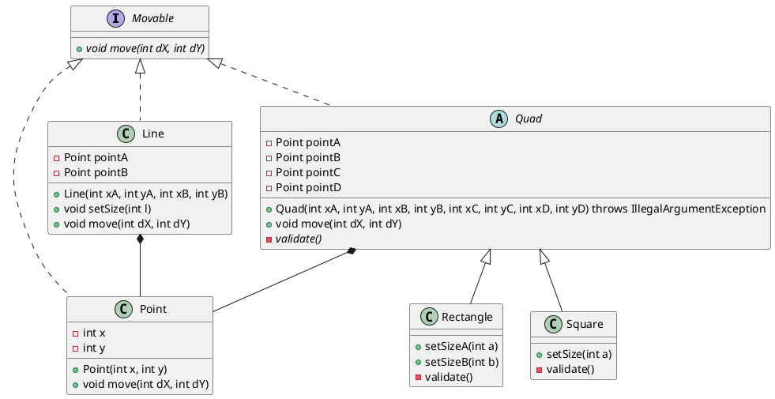

# ООП (ООД). Геометрические фигуры. 

Приведите диаграмму классов или код иерархии объектов точка, линия, прямоугольник и квадрат. Постройте приложение, создающее фигуры, изменяющее фигуры и "рисующее" их через toString

Основные моменты:
- Методы перемещения реализуем только у `Point`, остальные классы вызывают перемещение у своих `Point`.
- Линия - самостоятельная фигура, у которой нет ограничений и свой способ изменения длины.
- Квадрат и прямоугольник унаследованы от абстрактного четырехугольника, который реализует базовый функционал хранения координат и требует реализовать проверку установки этих координат. Эта же абстракция реализует перемещение. Но изменение размеров реализуют сами классы фигур.

